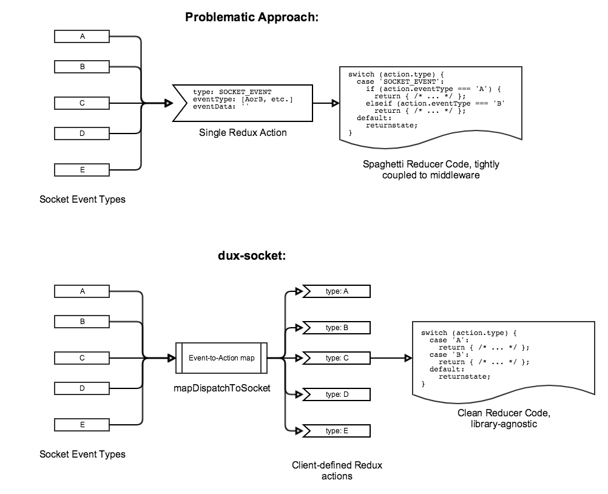

# dux-socket [](https://travis-ci.org/americanexpress/dux-socket)

```
                 _,,...,_
             .’¯         ’-_
           .¯               -
          /                  \
      -----.,      @          ;
=====|       \                |
     |        }               ;   _
=====|       /               / ,~¯ ‘.
      -----~’               , /      \
            ~_            ,’~’        \
          _,-‘                         \
        ,’                              \
      ,¯                  _,..,_    ,~’, ,
     ‘                   ¯       `¯¯     ;
    ‘                   |              , ;
    ‘                   ;          ._.-  /
     ‘                   \            ,`/
      ‘                   ‘,       - ‘.’
        ‘.                  ‘-.,,.-‘.~
          ¯~.,_              _,.-~’¯
                `’’’’’’’’’¯¯¯
```

Flexible WebSocket middleware for Redux applications. Maps inbound WebSocket events to Redux actions. Exposes action creators for dispatching actions that should be emitted as socket messages. Works with __Socket.IO__, as well as native WebSocket implementations!

## Installation
    npm install dux-socket

## Usage

### Socket.IO
In your project, define a __`mapDispatchToSocket`__ function, which will receive `store.dispatch` as its argument, and return an object which maps socket events to arbitrary Redux actions:
 
    const mapDispatchToSocket = (dispatch) => ({
        'eventName': (eventData) => dispatch({type: 'SOME_ACTION', data: eventData}),
        
        // using action creators
        'otherEvent': (eventData) => dispatch(someAction(eventData)),
    });

This works exactly like the `mapDispatchToProps` function you are used to from React-Redux's `connect` API. The functions defined in this map will be invoked with the socket event payload as the argument.

When creating your store & applying middleware, add __`socketMiddleware`__ in the usual way, supplying the `mapDispatchToSocket` function defined above, & an initialized `Socket` object:

    import {createStore, applyMiddleware} from 'redux';
    import io from 'socket.io-client'
    import {socketMiddleware} from 'dux-socket';
    
    const socket = io('http://socket-url');
    
    const store = createStore(
        appReducer,
        applyMiddleware(
            /* ... other middlewares here ... */
            socketMiddleware(mapDispatchToSocket, socket)
        )
    );

#### Emitting socket events
Simply `dispatch` using the __`emit(eventName, data)`__ action creator supplied by `dux-socket` in order to emit a socket event:

    import {emit} from 'dux-socket';
    
    dispatch(emit('someAction', {foo: bar}))

### Native WebSockets
Since native WebSocket implementations don't have a concept of named events, your `mapDispatchToSocket` function, and the way you send data work a bit differently. Simply supply functions for the native WebSocket event handlers `onopen`, `onmessage`, and `onerror` where relevant to your application, and map them to Redux actions however you see fit:

    import {socketMiddleware} from 'dux-socket';
    import {createStore, applyMiddleware} from 'redux';
    
    let socket = new WebSocket('ws://localhost:4242');
    
    const mapDispatchToSocket = (dispatch) => ({
      'onmessage': (event) => dispatch({ type: 'CHAT_MESSAGE', message: event.data }),
      'onerror': (event) => dispatch({ type: 'ERROR', msg: 'Connection error!' })
    });
    
    const store = createStore(
      appReducer,
      applyMiddleware(socketMiddleware(mapDispatchToSocket, socket))
    );

#### Sending text data
Use the __`send(data)`__ action creator to send data over a native WebSocket connection.

    import {send} from 'dux-socket';
    
    dispatch(send('some data!'))

### Asynchronous socket initialization
You may want to include some asynchronously-resolved data (ie. route parameters) in your initial connection with the WebSocket server. To do this, simply __don't__ supply a WebSocket object when applying the `socketMiddleware`:
    
    const store = createStore(
        appReducer,
        applyMiddleware(socketMiddleware(mapDispatchToSocket))
    );

And dispatch an `initSocket` event when you are ready to initialize the socket! Supply this action creator with either a Socket.IO object or a native WebSocket object.

    import io from 'socket.io-client'
    import {initSocket} from 'dux-socket';
    import store from '../store';
    
    class SomeComponent extends Component {
        componentDidMount() {
            let socket = io('http://socket-url', { foo: 'bar' });
            store.dispatch(initSocket(socket));
        }
    }

## Motivation
Flexibility! The main goals for a flexible Redux/WebSocket middleware are:

1. __Event-agnostic__: You should be able to integrate an existing Redux application with an existing WebSocket server without re-writing your server-initiated events or your client-side reducers.
2. __Asynchronous__: You should be able to _(optionally)_ initialize your web socket connection asynchronously. This is useful if you want to include some resolved data in your handshake with the web socket server, (ie. router parameters)
3. __Native WebSocket support__: You should be able to _(optionally)_ use a native WebSocket implementation, in case you don't want to use Socket.IO

Other middleware libraries emit a single Redux action for all Socket events. This leads to tightly coupled reducers & nested branching over the event types within your reducer cases. __dux-socket__ solves this problem by invoking  _client-defined_ actions according to the map provided:



## Contributing
  
We welcome Your interest in the American Express Open Source Community on Github.
Any Contributor to any Open Source Project managed by the American Express Open Source
Community must accept and sign an Agreement indicating agreement to the terms below.
Except for the rights granted in this Agreement to American Express and to recipients of
software distributed by American Express, You reserve all right, title, and interest, if any, in and
to Your Contributions. Please
[fill out the Agreement](https://cla-assistant.io/americanexpress/dux-socket).

## License
Any contributions made under this project will be governed by the [Apache License
2.0](https://github.com/americanexpress/dux-socket/blob/master/LICENSE.txt).

## Code of Conduct
This project adheres to the [American Express Community Guidelines](https://github.com/americanexpress/dux-socket/wiki/Code-of-Conduct).
By participating, you are expected to honor these guidelines.
